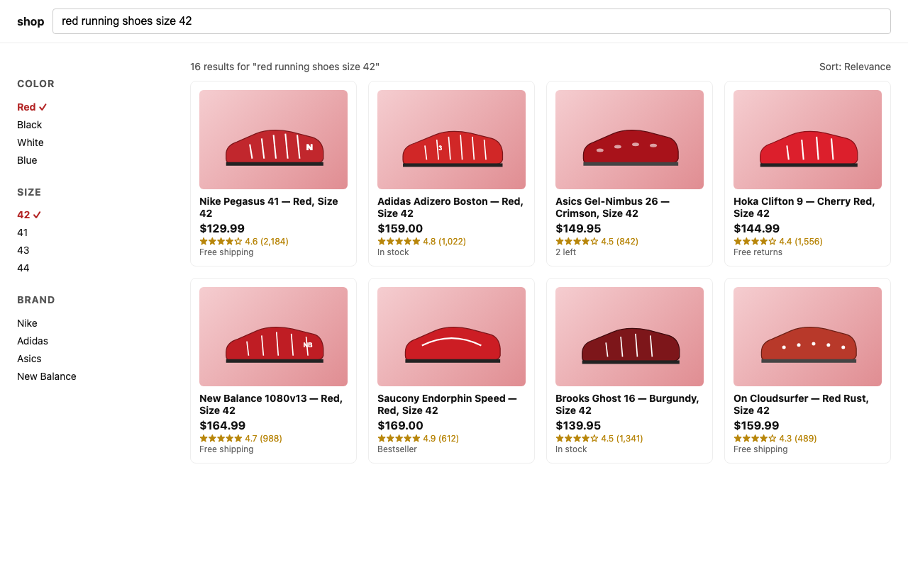
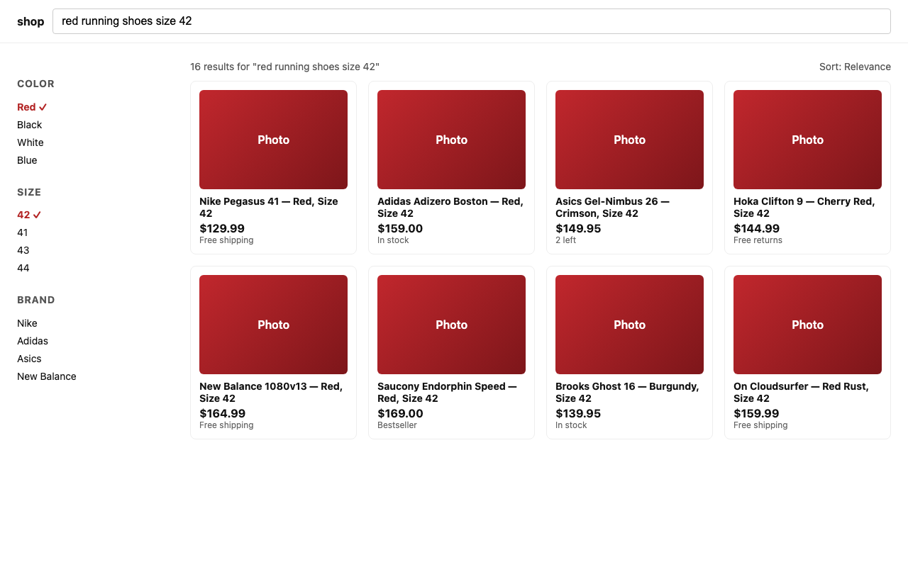

# Green CI, Broken UI: an LLM-as-Judge for Playwright + Gemini 2.5

*Why `expect(results).toHaveCount(20)` is lying to you, and what to do about it.*

---

## It's 3 AM and the test is green

You wake up to a Slack ping. A staff engineer has shipped a search-ranker change at midnight. The CI dashboard is a wall of green. Every Playwright test passed. Yet a screenshot in the bug channel shows the search page returning *"red running shoes"* results that are mostly white sneakers, sorted by some forgotten popularity score.

Your tests are not lying. They are answering the wrong question.

```ts
await expect(page.getByRole('listitem')).toHaveCount(20)   // green
await expect(page.getByText(/relevance/i)).toBeVisible()   // green
await expect(page).toHaveScreenshot('search.png')          // green-ish, you marked it as updateSnapshots last week
```

Dynamic UIs break our assertion vocabulary in three ways:

1. **Hard assertions can't see relevance.** A list of 20 items is not the same as a list of 20 *good* items.
2. **Visual diff churns daily.** Search results legitimately change. Pixel diffs become a baseline-update treadmill.
3. **Snapshots rotate.** Personalization, A/B tests, inventory shifts — your "stable" snapshot is a lie within a week.

What if a test could *read* the page the way a thoughtful PM does, return a graded verdict, and explain itself? That is the LLM-as-Judge pattern. This article wires one into Playwright in **under 150 lines of TypeScript**, using **Gemini 2.5 Flash** (free tier, no credit card). Every snippet below is copy-paste runnable; the full repo is linked at the end.

---

## 1. The LLM-as-Judge pattern

The pattern was born in model evaluation: a strong model grades weaker models' answers against a rubric, scaling human review that would otherwise be impossible. Translate that to UI testing — instead of "is answer A better than B," we ask "given this rubric, is the page in front of you doing its job?" The judge is **graded, not absolute**. It returns:

- a `verdict` — `pass`, `fail`, or `warn`
- a numeric `score` from 0 to 1
- an array of `issues` it observed
- a short `rationale` for the human reading the failure

The mental shift matters. A judge is **not an oracle.** It is probabilistic, occasionally wrong, and always opinionated. We use it where deterministic assertions cannot reach:

**Use it for:**

- Dynamic content — search, recommendations, feeds
- Vague acceptance criteria (*"results should be relevant"*)
- Copy / UX quality
- Heuristic accessibility — alt-text quality, scan order

**Don't use it for:**

- Deterministic flows — login → dashboard
- Performance budgets
- Pixel-perfect cross-browser checks
- Strict WCAG compliance — use axe-core instead

Trendyol's mobile testing team [recently scaled from 4,869 to 10,400 UI tests in under a year](https://medium.com/trendyol-tech/scaling-mobile-ui-testing-with-ai-02b78bc50a5e) using AI to *generate* tests. The judge pattern is the natural complement on the *verification* side: AI that decides whether the UI it sees is acceptable, not just whether the test it ran did not throw.

---

## 2. The stack

We need three ingredients:

- **Playwright** — captures both a screenshot and an `aria-snapshot` of the rendered page.
- **Gemini 2.5 Flash** — accepts vision input natively and supports structured JSON output via `responseJsonSchema`.
- **A hybrid input** — we send both the screenshot *and* the aria-snapshot to the model.

Why hybrid? A screenshot alone catches visual regressions but burns tokens and misses semantic intent. An aria-snapshot alone is cheap and deterministic but ignores layout, typography, and broken images. Combined, the two signals reinforce each other: the model resolves visual ambiguity using the semantic tree, and reads the tree against the screenshot's actual rendering.

Why Gemini specifically? Three reasons:

- **Free tier**: `gemini-2.5-flash` covers casual local development without a credit card. Get a key at [aistudio.google.com](https://aistudio.google.com/apikey).
- **Native multimodal**: a single call accepts screenshot + text — no separate vision adapter, no manual base64 wrapping in a `data:` URL.
- **`responseJsonSchema` is enforced server-side**. The SDK guarantees valid JSON; we still re-validate with zod for defense in depth.

```bash
npm i -D @playwright/test
npm i @google/genai zod dotenv
```

`dotenv` lets the SDK pick up `GEMINI_API_KEY` from a local `.env` — Playwright's config calls `dotenv.config()` at startup, so the key is loaded before any test runs.

Repo skeleton:

```
playwright-llm-judge-demo/
├── src/
│   ├── judge.ts          # the Gemini call
│   ├── rubric.ts         # default search-results rubric
│   ├── schema.ts         # zod schema for the verdict
│   └── fixtures.ts       # captureJudgeContext + custom matcher
└── tests/search.spec.ts  # the demo test
```

---

## 3. Building the judge

### 3.1 Capture hybrid context

A small helper grabs the two artifacts in one call:

```ts
// src/fixtures.ts
import { Page } from '@playwright/test'
import type { JudgeContext } from './judge' // declared in §3.4 — { url, ariaSnapshot, screenshot }

export async function captureJudgeContext(page: Page): Promise<JudgeContext> {
  return {
    url: page.url(),
    ariaSnapshot: await page.locator('main, body').first().ariaSnapshot(),
    screenshot: (await page.screenshot({ fullPage: false })).toString('base64'),
  }
}
```

`ariaSnapshot()` returns a YAML-ish tree of accessible roles and names — exactly what a screen reader sees, which is also exactly what we want a judge to reason about.

### 3.2 Define the rubric

The rubric is the test's intent in plain English. Keep it short and concrete:

```ts
// src/rubric.ts
export const searchResultsRubric = (query: string) => `
You are evaluating a search-results page for the query: "${query}".
Mark the page as PASS if all of the following hold; otherwise FAIL or WARN:
1. The visible products are clearly relevant to the query (>= 70% of visible items).
2. Each result has an image, title, and price.
3. The first result is not visibly broken (no missing image, no overlapping CTA).
4. A facet/filter panel is present and includes at least one query-relevant filter.
5. No empty-state text is shown when results exist.
Return FAIL only when at least one rule is broken in a user-visible way.
Return WARN when the page works but quality is borderline.
`
```

### 3.3 Define the structured output

Structured outputs are non-negotiable. Free-form judge replies will derail your CI:

```ts
// src/schema.ts
import { z } from 'zod'

export const Verdict = z.object({
  verdict: z.enum(['pass', 'fail', 'warn']),
  score: z.number().min(0).max(1),
  issues: z.array(z.string()).max(10),
  rationale: z.string().max(800),
})
export type Verdict = z.infer<typeof Verdict>
```

We declare the equivalent JSON schema inline when calling Gemini — the SDK enforces it server-side, and zod re-validates on the way out so a malformed response fails loud.

### 3.4 The `judge()` function

```ts
// src/judge.ts
import { GoogleGenAI, Type } from '@google/genai'
import { Verdict } from './schema'

export interface JudgeContext {
  url: string
  ariaSnapshot: string
  screenshot: string  // base64-encoded PNG
}

let client: GoogleGenAI | null = null
const getClient = (): GoogleGenAI => {
  if (!client) {
    const key = process.env.GEMINI_API_KEY
    if (!key) throw new Error('GEMINI_API_KEY required')
    client = new GoogleGenAI({ apiKey: key })
  }
  return client
}
const MODEL = process.env.GEMINI_MODEL ?? 'gemini-2.5-flash'

export async function judge(rubric: string, ctx: JudgeContext): Promise<Verdict> {
  const response = await getClient().models.generateContent({
    model: MODEL,
    contents: [
      {
        role: 'user',
        parts: [
          { text: `Page URL: ${ctx.url}\n\nAccessibility tree:\n${ctx.ariaSnapshot}` },
          { inlineData: { mimeType: 'image/png', data: ctx.screenshot } },
        ],
      },
    ],
    config: {
      systemInstruction: rubric,
      temperature: 0,
      responseMimeType: 'application/json',
      responseJsonSchema: {
        type: Type.OBJECT,
        properties: {
          verdict: { type: Type.STRING, enum: ['pass', 'fail', 'warn'] },
          score: { type: Type.NUMBER },
          issues: { type: Type.ARRAY, items: { type: Type.STRING } },
          rationale: { type: Type.STRING },
        },
        required: ['verdict', 'score', 'issues', 'rationale'],
        propertyOrdering: ['verdict', 'score', 'issues', 'rationale'],
      },
    },
  })

  return Verdict.parse(JSON.parse(response.text!))
}
```

A few details worth flagging:

- **Lazy client init.** Constructing `GoogleGenAI` at module-load time fails if `GEMINI_API_KEY` is unset — a confusing crash before any test runs. The `getClient()` thunk defers that until the first call, so type-checking and unrelated tests stay green.
- **`systemInstruction`** carries the rubric. It biases the model's behavior for the entire call without occupying a slot in the user-content stream.
- **`temperature: 0`** gets us as close to deterministic as the API allows.
- **`inlineData`** wraps the base64 screenshot. Unlike OpenAI's `image_url`, Gemini wants raw base64 plus a mime type — no `data:` URL wrapping.
- **`responseJsonSchema`** is enforced server-side, but it enforces *shape*, not *semantics*. Zod tightens the contract: `score ∈ [0, 1]`, `issues` capped at 10, `rationale` capped at 800 chars. Catch the mismatch here, not during a midnight CI investigation.

### 3.5 A custom Playwright matcher

```ts
// src/fixtures.ts (continued)
import { expect as baseExpect } from '@playwright/test'

export const expect = baseExpect.extend({
  async toBeJudgedRelevant(page: Page, query: string) {
    const ctx = await captureJudgeContext(page)
    const verdict = await judge(searchResultsRubric(query), ctx)
    return {
      pass: verdict.verdict === 'pass',
      message: () =>
        `Judge verdict: ${verdict.verdict} (score ${verdict.score.toFixed(2)})\n` +
        `Issues:\n - ${verdict.issues.join('\n - ')}\n\n${verdict.rationale}`,
      name: 'toBeJudgedRelevant',
      expected: 'pass',
      actual: verdict.verdict,
    }
  },
})
```

The matcher returns `pass: verdict.verdict === 'pass'`, which means Playwright's `.not` modifier inverts cleanly — useful in a moment.

### 3.6 The demo tests

A judge demo that only shows green is half a demo. The companion repo runs three scenarios:

```ts
// tests/search.spec.ts
import * as path from 'path'
import { test, expect } from '../src/fixtures'

const QUERY = 'red running shoes size 42'
const liveUrl = `https://www.amazon.com/s?k=${encodeURIComponent(QUERY)}`
const goodUrl = `file://${path.resolve(__dirname, '../fixtures/search-good.html')}`
const brokenUrl = `file://${path.resolve(__dirname, '../fixtures/search-broken.html')}`

const runLocal = process.env.RUN_AGAINST_LOCAL === 'true'

test.describe('search results judge', () => {
  test('passes a healthy results page', async ({ page }) => {
    test.skip(!runLocal, 'set RUN_AGAINST_LOCAL=true')
    await page.goto(goodUrl, { waitUntil: 'domcontentloaded' })
    await expect(page).toBeJudgedRelevant(QUERY)
  })

  test('catches a broken results page', async ({ page }) => {
    test.skip(!runLocal, 'set RUN_AGAINST_LOCAL=true')
    await page.goto(brokenUrl, { waitUntil: 'domcontentloaded' })
    await expect(page).not.toBeJudgedRelevant(QUERY)
  })

  test('judges the live target', async ({ page }) => {
    test.skip(runLocal, 'unset RUN_AGAINST_LOCAL to hit the live target')
    await page.goto(liveUrl, { waitUntil: 'domcontentloaded' })
    await page.waitForLoadState('networkidle', { timeout: 10_000 }).catch(() => {})
    await expect(page).toBeJudgedRelevant(QUERY)
  })
})
```

Two local fixtures, intentionally written to push the judge in opposite directions:

- `search-good.html` ships product images, prices, ratings, and active filters — the judge should return `pass`.
- `search-broken.html` ships placeholder thumbnails reading the literal word "Photo" — the judge should call this out, citing rule #3 (missing image), and the test asserts that with `expect(page).not.toBeJudgedRelevant(...)`.


*`search-good.html` — exactly what the judge sees on a healthy page. Verdict: `pass`.*


*`search-broken.html` — every thumbnail is a "Photo" placeholder. Verdict: `fail`, citing rule #3.*

When the broken page runs, the failure message is something a human can act on:

```
Judge verdict: fail (score 0.50)
Issues:
 - The first result "Nike Pegasus 41 — Red, Size 42" displays a 'Photo'
   placeholder instead of an actual product image.
 - All visible product results display 'Photo' placeholders.

Breaks rule #3 (first result must not have a missing image).
```

That is the report you wanted at 3 AM.

---

## 4. Production realities

A judge in CI is not a science experiment. Four levers keep it honest:

- **Determinism.** `temperature: 0` plus a server-enforced JSON schema is the floor. Wrap the call in a one-shot retry that runs only on schema-parse errors — never on `fail` verdicts. Retrying failures hides regressions.
- **Cost.** A hybrid call at 1280×800 lands around 2,000–2,500 tokens — a fraction of a cent on paid tier, and the free tier's 1,500 flash requests/day covers small CI loops. Cap image dimensions at the smallest size your rubric still works on, and don't run a judge on every PR.
- **CI caching.** Hash `(ariaSnapshot + downscaled screenshot)`. If the hash matches a previous green verdict, skip the call. Page genuinely changed → judge runs. Most search-results pages drift slowly enough that hit rates of 40–60% are realistic.
- **Privacy.** Never ship logged-in user data, real emails, or order IDs to the model. Mask before screenshot capture using Playwright's `page.evaluate()` to hide PII selectors, or run the judge only against guest sessions.

---

## 5. Limitations and what to build next

A judge is one tool, not a strategy. Three honest caveats:

- It is **not a replacement** for unit tests, integration tests, or accessibility scanners. Use it where heuristics beat hard assertions, not where hard assertions already work.
- The model has **opinions** baked in. Gemini has its own theory of "good UX" and will project that onto your interface. Calibrate the rubric against examples your team agrees on, and consider running the same fixture through `gemini-2.5-pro` and `gemini-2.5-flash` periodically to catch verdict drift between model versions.
- For high-stakes flows, run a **multi-judge consensus** — multiple calls (or multiple models) and a majority vote. Disagreement is itself a signal worth reviewing.

The horizon is agentic. Trendyol explicitly mentions [experimental agentic approaches for automated change analysis](https://medium.com/trendyol-tech/scaling-mobile-ui-testing-with-ai-02b78bc50a5e) — agents that observe a failure, hypothesize a cause, mutate locators, and re-run. The judge is the eyes of that agent. Get the judge right first; the agent will ride on top of it.

---

## Try it

Companion repo: **[github.com/1hasangunduz/playwright-llm-judge-demo](https://github.com/1hasangunduz/playwright-llm-judge-demo)** — clone it, drop your `GEMINI_API_KEY` into `.env`, then:

```bash
npm install
npx playwright install chromium
RUN_AGAINST_LOCAL=true npx playwright test   # runs both good + broken locally
npx playwright test                          # judges the live Amazon target
```

Free key at [aistudio.google.com/apikey](https://aistudio.google.com/apikey) — no card needed.

What dynamic surface in your product could a judge unblock this quarter?

---

### References

- Trendyol Tech — [Advanced Maestro Testing: Event Validation & AI-Powered Test Generation](https://medium.com/trendyol-tech/advanced-maestro-testing-event-validation-ai-powered-test-generation-0bb86f3ca481)
- Trendyol Tech — [Scaling Mobile UI Testing with AI](https://medium.com/trendyol-tech/scaling-mobile-ui-testing-with-ai-02b78bc50a5e)
- Trendyol Tech — [Test Automation Structure for Single Code Base Projects](https://medium.com/trendyol-tech/test-automation-structure-for-single-code-base-projects-58d8fb1f7250)
- Google AI — [Structured Output with the Gemini API](https://ai.google.dev/gemini-api/docs/structured-output)
- Google AI — [Vision capabilities of Gemini](https://ai.google.dev/gemini-api/docs/vision)
- Playwright — [`ariaSnapshot`](https://playwright.dev/docs/api/class-locator#locator-aria-snapshot)

---

*Hasan Gündüz is a software engineer at Insider. Find him on Medium and LinkedIn.*
